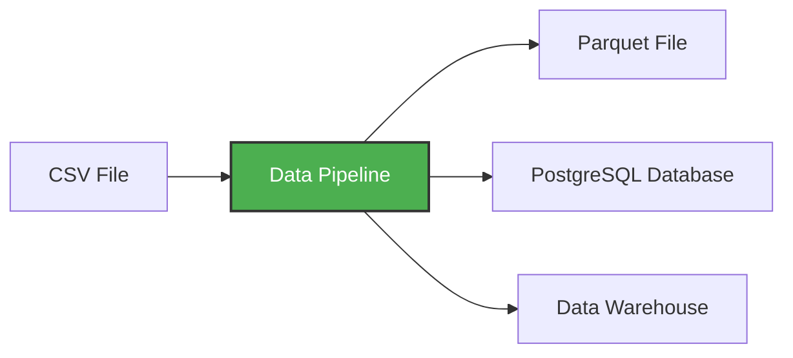

# 가상환경과 데이터 파이프라인

**[↑ 위로](README.md)** | **[← 이전](01-introduction.md)** | **[다음 →](03-dockerizing-pipeline.md)**

**데이터 파이프라인**이란 데이터를 입력으로 받아 또 다른 데이터를 출력하는 서비스입니다. 예를 들어 CSV 파일을 읽어서 데이터를 어떤 방식으로든 변환한 뒤 PostgreSQL 데이터베이스의 테이블로 저장하는 것입니다.



이 워크숍에서 만들 파이프라인은 다음과 같은 일을 합니다:
- 웹에서 CSV 데이터 다운로드
- pandas로 데이터 변환 및 정제
- 쿼리할 수 있도록 PostgreSQL에 적재
- 큰 파일을 처리하기 위해 데이터를 청크(chunk) 단위로 처리

## 간단한 파이프라인 만들기

예제 파이프라인을 만들어 봅시다. 먼저 `pipeline` 디렉터리를 만들고 그 안에 `pipeline.py` 파일을 생성합니다:

```python
import sys
print("arguments", sys.argv)

day = int(sys.argv[1])
print(f"Running pipeline for day {day}")
```

이제 pandas를 추가해 봅시다:

```python
import pandas as pd

df = pd.DataFrame({"A": [1, 2], "B": [3, 4]})
print(df.head())

df.to_parquet(f"output_day_{sys.argv[1]}.parquet")
```

## 왜 가상환경이 필요한가?

pandas가 필요한데 아직 설치되어 있지 않습니다. 컨테이너에서 실행하기 전에 먼저 테스트해 보고 싶습니다.

`pip`으로 설치할 수 있습니다:

```bash
pip install pandas pyarrow
```

하지만 이렇게 하면 시스템 전역에 설치됩니다. 서로 다른 프로젝트가 같은 패키지의 다른 버전을 필요로 할 때 충돌이 발생할 수 있습니다.

대신 **가상환경(virtual environment)** 을 사용합니다. 가상환경은 격리된 Python 환경으로, 이 프로젝트의 의존성을 다른 프로젝트나 시스템 Python과 분리해 관리해 줍니다.

## uv 사용하기 - 최신 Python 패키지 매니저

우리는 `uv`를 사용할 것입니다. Rust로 작성된 최신의 빠른 Python 패키지·프로젝트 매니저입니다. pip보다 훨씬 빠르고 가상환경을 자동으로 관리해 줍니다.

```bash
pip install uv
```

이제 uv로 Python 프로젝트를 초기화합니다:

```bash
uv init --python=3.13
```

이 명령은 의존성 관리를 위한 `pyproject.toml` 파일과 `.python-version` 파일을 생성합니다.

### Python 버전 비교하기

```bash
uv run which python  # 가상환경의 Python
uv run python -V

which python        # 시스템 Python
python -V
```

두 결과가 다른 것을 볼 수 있습니다. `uv run`은 격리된 환경을 사용합니다.

### 의존성 추가하기

이제 pandas를 추가합니다:

```bash
uv add pandas pyarrow
```

이 명령은 `pyproject.toml`에 pandas를 추가하고 가상환경에 설치합니다.

### 파이프라인 실행하기

이제 파일을 실행할 수 있습니다:

```bash
uv run python pipeline.py 10
```

다음과 같은 출력을 보게 됩니다:

* `['pipeline.py', '10']`
* `job finished successfully for day = 10`

## Git 설정

이 스크립트는 바이너리(parquet) 파일을 생성하므로, 실수로 git에 커밋하지 않도록 `.gitignore`에 parquet 확장자를 추가합시다:

```
*.parquet
```

**[↑ 위로](README.md)** | **[← 이전](01-introduction.md)** | **[다음 →](03-dockerizing-pipeline.md)**
