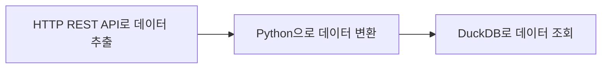
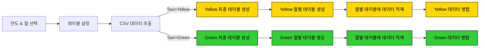
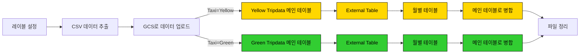
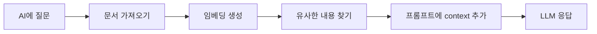

# Workflow Orchestration

Data Engineering Zoomcamp의 Module 2에 오신 것을 환영합니다! 이번 주에는 [Kestra](https://go.kestra.io/de-zoomcamp/github)를 사용해 workflow orchestration을 깊이 다뤄봅니다.

Kestra는 오픈소스 이벤트 기반 orchestration 플랫폼으로, 스케줄 기반 워크플로우와 이벤트 기반 워크플로우를 모두 간단하게 만들 수 있게 해줍니다. 데이터와 프로세스 orchestration에 Infrastructure as Code 방식을 적용하여, 단 몇 줄의 YAML만으로 안정적인 워크플로우를 구축할 수 있습니다.

> [!NOTE]  
> 이번 주의 모든 영상은 이 [YouTube 재생목록](https://go.kestra.io/de-zoomcamp/yt-playlist)에서 볼 수 있습니다.

---

## 강의 구성

- [2.1 - Workflow Orchestration 소개](#21-workflow-orchestration-소개)
- [2.2 - Kestra 시작하기](#22-kestra-시작하기)
- [2.3 - 실습 프로젝트: Kestra로 ETL 데이터 파이프라인 만들기](#23-실습-프로젝트-kestra로-데이터-파이프라인-만들기)
- [2.4 - Kestra의 ELT 파이프라인: Google Cloud Platform](#24-kestra의-elt-파이프라인-google-cloud-platform)
- [2.5 - Kestra에서 데이터 엔지니어링에 AI 활용하기](#25-kestra에서-데이터-엔지니어링에-ai-활용하기)
- [2.6 - 보너스](#26-보너스-클라우드에-배포하기-선택)


## 2.1 Workflow Orchestration 소개

이 섹션에서는 workflow orchestration의 기초, 그것이 왜 중요한지, 그리고 Kestra가 orchestration 생태계에서 어떤 위치에 있는지 배웁니다.

### 2.1.1 - Workflow Orchestration이란?

오케스트라를 떠올려 보세요. 다양한 악기가 있고, 어떤 악기는 다른 악기보다 비중이 크며, 음악을 연주할 때 각각 맡은 역할이 다릅니다. 이들이 정확한 타이밍에 어우러지도록, 연주자들은 지휘자를 따라 함께 연주합니다.

이제 악기를 도구(tool)로, 지휘자를 orchestrator로 바꿔서 생각해 보세요. 우리는 여러 도구와 플랫폼을 함께 동작시켜야 하는 경우가 많습니다. 어떤 때는 정해진 일정에 따라, 또 어떤 때는 발생한 이벤트에 따라서요. 바로 이 지점에서 orchestrator가 등장해 이 모든 도구가 협력하도록 돕습니다.

workflow orchestrator는 다음과 같은 일을 합니다:
- 미리 정의된 여러 단계로 이루어진 워크플로우를 실행
- 오류를 모니터링하고 기록하며, 오류 발생 시 추가 조치를 수행
- 스케줄과 이벤트를 기반으로 워크플로우를 자동 실행

데이터 엔지니어링에서는 데이터를 한 곳에서 다른 곳으로 옮기는 일이 잦고, 그 중간에 데이터를 가공해야 할 때도 있습니다. workflow orchestrator는 이런 단계들을 관리해 주면서 동시에 진행 상황을 들여다볼 수 있게 해줍니다.

이 모듈에서는 Kestra를 중심에 두고 ETL(Extract, Transform, Load) 방식으로 우리만의 데이터 파이프라인을 만들어 볼 텐데, 만들기에 앞서 Kestra가 어떻게 동작하는지 조금 더 알아야 합니다!

#### 영상
- **2.1.1 - Workflow Orchestration이란?**  
  [](https://youtu.be/-JLnp-iLins)


### 2.1.2 - Kestra란?

Kestra는 오픈소스이자 무한히 확장 가능한 orchestration 플랫폼으로, 모든 엔지니어가 비즈니스에 핵심적인 워크플로우를 관리할 수 있게 해줍니다.

Kestra가 workflow orchestration에 좋은 선택인 이유:
- Flow 코드(YAML), 노코드, 또는 AI Copilot으로 구축 — 워크플로우를 만드는 방식이 유연합니다
- 1,000개 이상의 플러그인 — 사용 중인 모든 도구와 연동됩니다
- 모든 프로그래밍 언어 지원 — 작업에 맞는 도구를 고를 수 있습니다
- 스케줄 또는 이벤트 기반 trigger — 워크플로우가 데이터에 반응하도록 만들 수 있습니다

#### 영상

- **2.1.2 - Kestra란?**  
  [](https://youtu.be/ZvVN_NmB_1s)

### 참고 자료
- [Quickstart Guide](https://go.kestra.io/de-zoomcamp/quickstart)
- [What is an Orchestrator?](https://go.kestra.io/de-zoomcamp/what-is-an-orchestrator)

---

## 2.2 Kestra 시작하기

이 섹션에서는 Kestra를 설치하는 방법과 첫 워크플로우를 만드는 데 필요한 핵심 개념을 배웁니다. 첫 워크플로우를 만든 뒤에는 워크플로우 안에서 Python 스크립트를 실행하는 데까지 확장해 봅니다.

여기서 할 일:
1. Docker Compose로 Kestra 설치하기
2. 첫 워크플로우를 만들기 위한 Kestra 개념 익히기
3. Kestra Flow 안에서 Python 스크립트 실행하기

### 2.2.1 - Kestra 설치하기

Kestra를 설치하기 위해 Docker Compose를 사용합니다. Module 1에서 이미 Postgres 데이터베이스와 pgAdmin을 설정해 두었으니, Kestra와 함께 계속 사용할 수 있습니다. 다만 Docker Compose 파일을 조금 수정해야 합니다.

[이 Docker Compose 예제 파일](docker-compose.yml)을 참고해 2개의 새 서비스를 추가하고 볼륨을 올바르게 설정하세요.

사용자 이름과 비밀번호 설정에 관한 정보도 추가하세요.

Kestra 서버용 컨테이너 하나와 Postgres 데이터베이스용 컨테이너 하나로 구성된 Docker Compose로 Kestra를 설정합니다:

```bash
cd 02-workflow-orchestration
docker compose up -d
```

**참고:** `pgAdmin`이 Kestra와 같은 포트에서 실행되고 있지 않은지 확인하세요. 만약 그렇다면 README 하단의 [FAQ](#문제-해결-팁)를 확인하세요.

컨테이너가 시작되면 [http://localhost:8080](http://localhost:8080)에서 Kestra UI에 접속할 수 있습니다.

Kestra를 종료하려면 같은 디렉터리에서 다음 명령어를 실행하세요:

```bash
docker compose down
```
#### Kestra에 Flow 추가하기

Flow는 YAML을 에디터에 직접 복사해서 붙여넣거나, Kestra의 API를 통해 추가할 수 있습니다. 프로그래밍 방식으로 추가하려면 아래를 참고하세요.

<details>
<summary>프로그래밍 방식으로 Kestra에 Flow 추가하기</summary>

Kestra의 API를 사용해 flow를 프로그래밍 방식으로 추가하려면 다음 명령어들을 실행하세요:

```bash
# 모든 flow 가져오기: 사용자명 admin@kestra.io, 비밀번호 Admin1234! 를 가정합니다 (본인 것에 맞게 조정하세요)
curl -X POST -u 'admin@kestra.io:Admin1234!' http://localhost:8080/api/v1/flows/import -F fileUpload=@flows/01_hello_world.yaml
curl -X POST -u 'admin@kestra.io:Admin1234!' http://localhost:8080/api/v1/flows/import -F fileUpload=@flows/02_python.yaml
curl -X POST -u 'admin@kestra.io:Admin1234!' http://localhost:8080/api/v1/flows/import -F fileUpload=@flows/03_getting_started_data_pipeline.yaml
curl -X POST -u 'admin@kestra.io:Admin1234!' http://localhost:8080/api/v1/flows/import -F fileUpload=@flows/04_postgres_taxi.yaml
curl -X POST -u 'admin@kestra.io:Admin1234!' http://localhost:8080/api/v1/flows/import -F fileUpload=@flows/05_postgres_taxi_scheduled.yaml
curl -X POST -u 'admin@kestra.io:Admin1234!' http://localhost:8080/api/v1/flows/import -F fileUpload=@flows/06_gcp_kv.yaml
curl -X POST -u 'admin@kestra.io:Admin1234!' http://localhost:8080/api/v1/flows/import -F fileUpload=@flows/07_gcp_setup.yaml
curl -X POST -u 'admin@kestra.io:Admin1234!' http://localhost:8080/api/v1/flows/import -F fileUpload=@flows/08_gcp_taxi.yaml
curl -X POST -u 'admin@kestra.io:Admin1234!' http://localhost:8080/api/v1/flows/import -F fileUpload=@flows/09_gcp_taxi_scheduled.yaml
curl -X POST -u 'admin@kestra.io:Admin1234!' http://localhost:8080/api/v1/flows/import -F fileUpload=@flows/10_chat_without_rag.yaml
curl -X POST -u 'admin@kestra.io:Admin1234!' http://localhost:8080/api/v1/flows/import -F fileUpload=@flows/11_chat_with_rag.yaml
```
</details>

#### 영상

- **2.2.1 - Kestra 설치하기**  
  [](https://youtu.be/wgPxC4UjoLM)

#### 참고 자료
- [Install Kestra with Docker Compose](https://go.kestra.io/de-zoomcamp/docker-compose)


### 2.2.2 - Kestra 개념

Kestra에서 워크플로우를 만들기 시작하려면 몇 가지 개념을 이해해야 합니다.
- [Flow](https://go.kestra.io/de-zoomcamp/flow) - task들과 그 orchestration 로직을 담는 컨테이너입니다.
- [Tasks](https://go.kestra.io/de-zoomcamp/tasks) - flow 안의 각 단계입니다.
- [Inputs](https://go.kestra.io/de-zoomcamp/inputs) - 실행 시점에 flow로 전달되는 동적인 값입니다.
- [Outputs](https://go.kestra.io/de-zoomcamp/outputs) - task와 flow 사이에 데이터를 전달합니다.
- [Triggers](https://go.kestra.io/de-zoomcamp/triggers) - flow 실행을 자동으로 시작시키는 장치입니다.
- [Execution](https://go.kestra.io/de-zoomcamp/execution) - 특정 상태를 가진 flow의 단일 실행입니다.
- [Variables](https://go.kestra.io/de-zoomcamp/variables) - task 전반에서 값을 재사용할 수 있게 해주는 키-값 쌍입니다.
- [Plugin Defaults](https://go.kestra.io/de-zoomcamp/plugin-defaults) - 하나 이상의 flow 안에서 특정 타입의 모든 task에 적용되는 기본값입니다.
- [Concurrency](https://go.kestra.io/de-zoomcamp/concurrency) - 한 flow의 실행이 동시에 몇 개까지 돌 수 있는지 제어합니다.

강력한 워크플로우를 만드는 데 쓰이는 개념은 이보다 더 많지만, 데이터 파이프라인을 만들 때 우리가 사용할 것은 위의 개념들입니다.

[`01_hello_world.yaml`](flows/01_hello_world.yaml) flow는 이 모든 개념을 하나의 워크플로우 안에서 보여줍니다:
- 이 flow에는 5개의 task가 있습니다: 로그 task 3개와 sleep task 1개
- 이 flow는 `name`이라는 input을 받습니다.
- `name` input을 받아 전체 환영 메시지를 생성하는 variable이 있습니다.
- return task에서 output이 생성되고, 뒤이은 로그 task에서 기록됩니다.
- 이 flow를 매일 오전 10시에 실행하는 trigger가 있습니다.
- Plugin Defaults를 사용해 두 로그 task 모두 메시지를 `ERROR` 레벨로 보내도록 합니다.
- 동시 실행 제한이 2로 설정되어 있습니다. 2개가 실행 중일 때 추가로 실행하면 실패합니다.

#### 영상
- **2.2.2 - Kestra 개념**  
  [](https://youtu.be/MNOKVx8780E)

#### 참고 자료
- [Tutorial](https://go.kestra.io/de-zoomcamp/tutorial)
- [Workflow Components Documentation](https://go.kestra.io/de-zoomcamp/workflow-components)

### 2.2.3 - Python 코드 orchestration하기

첫 워크플로우를 만들었으니, 이제 flow에 Python 코드를 추가해 한 단계 더 나아가 봅니다. Kestra에서는 별도의 파일에 있는 Python 코드를 실행할 수도 있고, 워크플로우 안에 직접 작성할 수도 있습니다.

Kestra에는 워크플로우 구축에 쓸 수 있는 플러그인이 아주 다양하게 준비되어 있지만, 직접 코드를 작성해 스케줄이나 이벤트에 따라 Kestra가 실행하도록 할 수도 있습니다. 즉, 제한된 도구에 맞추는 게 아니라 파이프라인에 맞는 적절한 도구를 직접 고를 수 있다는 뜻입니다.

Python 워크플로우 예제인 [`02_python.yaml`](flows/02_python.yaml)에서는, 코드가 DockerHub에서 Docker 이미지 pull 횟수를 가져와 Kestra에 output으로 반환합니다. Python 스크립트 안에서 생성된 값이지만 다른 task에서 이 output에 접근할 수 있다는 점에서 유용합니다.

#### 영상
- **2.2.3 - Python 코드 orchestration하기**  
  [](https://youtu.be/VAHm0R_XjqI)

#### 참고 자료
- [How-to Guide: Python](https://go.kestra.io/de-zoomcamp/python)


## 2.3 실습 프로젝트: Kestra로 데이터 파이프라인 만들기

다음으로, 뉴욕시 택시·리무진 위원회(TLC)의 Yellow/Green Taxi 데이터를 위한 ETL 파이프라인을 만들어 봅니다. 여기서 할 일:
1. [CSV 파일](https://github.com/DataTalksClub/nyc-tlc-data/releases)에서 데이터 추출하기
2. Postgres 또는 Google Cloud(GCS + BigQuery)로 적재하기
3. 워크플로우의 스케줄링과 backfill 살펴보기

### 2.3.1 시작용 파이프라인

이 입문용 flow는 HTTP REST API로 데이터를 추출하고, Python으로 그 데이터를 변환한 뒤, DuckDB로 조회하는 간단한 데이터 파이프라인을 보여주기 위해 추가되었습니다. 이 단계에서는 실습을 위해 별도의 새로운 Postgres 데이터베이스가 생성됩니다.




아직 추가하지 않았다면 UI에서 [`03_getting_started_data_pipeline.yaml`](flows/03_getting_started_data_pipeline.yaml) flow를 추가하고 실행해서 결과를 확인하세요. Gantt 탭과 Logs 탭을 살펴보며 flow 실행 과정을 이해해 보세요.

#### 영상

- **2.3.1 - 시작용 파이프라인**   
  [](https://youtu.be/-KmwrCqRhic)

#### 참고 자료
- [ETL Tutorial Video](https://go.kestra.io/de-zoomcamp/etl-tutorial)
- [ETL in 3 Minutes](https://go.kestra.io/de-zoomcamp/etl-get-started)

### 2.3.2 로컬 DB: Taxi 데이터를 Postgres에 적재하기

GCP로 데이터를 적재하기 전에, 먼저 Docker 컨테이너에서 실행되는 로컬 Postgres 데이터베이스로 Yellow/Green Taxi 데이터를 다뤄봅니다. Module 1에서 사용한 것과 같은 데이터베이스를 사용하며, Kestra와 같은 Docker Compose 파일에 있어야 합니다.

이 flow는 연도와 월로 파티션된 CSV 데이터를 추출하고, 테이블을 생성하고, 월별 테이블에 데이터를 적재한 뒤, 최종적으로 목적지 테이블에 데이터를 병합합니다.



flow 코드: [`04_postgres_taxi.yaml`](flows/04_postgres_taxi.yaml).


> [!NOTE]  
> [nyc.gov](https://www.nyc.gov/site/tlc/about/tlc-trip-record-data.page) 웹사이트에서 제공하는 NYC Taxi and Limousine Commission(TLC) Trip Record Data는 현재 Parquet 형식으로만 제공되지만, 이 강의에서 사용할 데이터셋은 그것이 아닙니다. 이 강의에서는 [GitHub의 여기](https://github.com/DataTalksClub/nyc-tlc-data/releases)에서 제공하는 **CSV 파일**을 사용합니다. Parquet 형식은 입문자가 이해하기 어려울 수 있고, 이 강의를 최대한 접근하기 쉽게 만들고 싶기 때문입니다 — CSV 형식은 Excel이나 Google Sheets, 심지어 단순한 텍스트 에디터로도 쉽게 들여다볼 수 있습니다.

#### 영상

- **2.3.2 - 로컬 DB: Taxi 데이터를 Postgres에 적재하기**   
  [](https://youtu.be/Z9ZmmwtXDcU)

#### 참고 자료
- [Kestra, Postgres, pgAdmin이 포함된 Docker Compose](docker-compose.yml)

### 2.3.3 로컬 DB: 스케줄링과 backfill 익히기

이제 위에서 만든 파이프라인을 매일 UTC 오전 9시에 실행되도록 스케줄링할 수 있습니다. 또한 과거 데이터에 대해 데이터 파이프라인을 실행하는 backfill 방법도 살펴봅니다.

참고: 데이터셋이 크기 때문에 2019년 green taxi 데이터셋에 대해서만 backfill을 진행합니다.

flow 코드: [`05_postgres_taxi_scheduled.yaml`](flows/05_postgres_taxi_scheduled.yaml).

#### 영상

- **2.3.3 - 스케줄링과 backfill**  
  [](https://youtu.be/1pu_C_oOAMA)
---

## 2.4 Kestra의 ELT 파이프라인: Google Cloud Platform

Postgres를 사용해 로컬에서 ETL 파이프라인을 만드는 법을 배웠으니, 이제 클라우드로 넘어갈 준비가 되었습니다. 이 섹션에서는 같은 Yellow/Green Taxi 데이터를 Google Cloud Platform(GCP)에 적재합니다. 사용할 것은:
1. data lake로서의 Google Cloud Storage(GCS)
2. data warehouse로서의 BigQuery

### 2.4.1 - ETL vs ELT

2.3에서는 Kestra 안에서 ETL 파이프라인을 만들었습니다:
- **Extract:** 먼저 GitHub에서 데이터셋을 추출합니다
- **Transform:** 다음으로 Python으로 변환합니다
- **Load:** 마지막으로 Postgres 데이터베이스에 적재합니다

이 방식은 업계에서 매우 일반적이지만, 클라우드에서 작업할 때는 순서를 바꾸는 것이 합리적일 때가 있습니다. Yellow Taxi 데이터처럼 큰 데이터셋을 다룬다면, 추출해서 곧바로 data warehouse에 적재한 뒤 data warehouse 안에서 직접 변환하는 것이 유리할 수 있습니다. BigQuery로 작업할 때는 ELT를 사용합니다:
- **Extract:** 먼저 GitHub에서 데이터셋을 추출합니다
- **Load:** 다음으로 이 데이터셋(여기서는 csv 파일)을 data lake(Google Cloud Storage)에 적재합니다
- **Transform:** 마지막으로 data warehouse(BigQuery) 안에 테이블을 만들고, data lake의 데이터를 사용해 변환을 수행합니다

변환하기 전에 data warehouse에 적재하는 이유는, 큰 데이터셋을 변환할 때 클라우드의 성능상 이점을 활용할 수 있기 때문입니다. 로컬 머신에서는 오래 걸릴 작업이 클라우드에서는 훨씬 짧은 시간에 끝날 수 있습니다.

다음 몇 개의 영상에서는 BigQuery를 설정하고 Yellow Taxi 데이터셋을 변환하는 것을 살펴봅니다.

#### 영상

- **2.4.1 - ETL vs ELT**  
  [](https://youtu.be/E04yurp1tSU)

#### 참고 자료
- [ETL vs ELT Video](https://go.kestra.io/de-zoomcamp/etl-vs-elt)
- [Data Warehouse 101 Video](https://go.kestra.io/de-zoomcamp/data-warehouse-101)
- [Data Lakes 101 Video](https://go.kestra.io/de-zoomcamp/data-lakes-101)

### 2.4.2 Google Cloud Platform(GCP) 설정하기

GCP에 데이터를 적재하기 전에 Google Cloud Platform을 설정해야 합니다.

먼저 다음 flow [`06_gcp_kv.yaml`](flows/06_gcp_kv.yaml)을 수정해서 서비스 계정, GCP 프로젝트 ID, BigQuery 데이터셋, GCS 버킷 이름(_그리고 그 location_)을 KV Store 값으로 넣으세요:
- GCP_PROJECT_ID
- GCP_LOCATION
- GCP_BUCKET_NAME
- GCP_DATASET

#### GCP 리소스 생성하기

강의 첫 주에 GCS 버킷과 BigQuery 데이터셋을 아직 만들지 않았다면, 이 flow로 생성할 수 있습니다: [`07_gcp_setup.yaml`](flows/07_gcp_setup.yaml).

> [!WARNING]  
> `GCP_CREDS` 서비스 계정에는 민감한 정보가 담겨 있습니다. 안전하게 보관하고 Git에 커밋하지 마세요. 비밀번호와 같은 수준으로 관리하세요.


#### 영상

- **2.4.2 - Google Cloud Platform 설정하기**  
  [](https://youtu.be/TLGFAOHpOYM)

#### 참고 자료
- [Set up Google Cloud Service Account in Kestra](https://go.kestra.io/de-zoomcamp/google-sa)

### 2.4.3 GCP 워크플로우: Taxi 데이터를 BigQuery에 적재하기

Google Cloud에 스토리지 버킷이 설정되었으니 ELT 과정을 시작할 수 있습니다.



flow 코드: [`08_gcp_taxi.yaml`](flows/08_gcp_taxi.yaml).

#### 영상

- **2.4.3 - Kestra에서 GCS와 BigQuery로 ETL 파이프라인 만들기**  
  [](https://youtu.be/52u9X_bfTAo)

### 2.4.4 GCP 워크플로우: 전체 데이터셋 스케줄링과 backfill

이제 위 파이프라인을 green 데이터셋은 매일 UTC 오전 9시에, yellow 데이터셋은 매일 UTC 오전 10시에 실행되도록 스케줄링할 수 있습니다. 과거 데이터는 Kestra UI에서 바로 backfill할 수 있습니다.

이제 무한히 확장 가능한 스토리지와 컴퓨팅을 갖춘 클라우드 환경에서 데이터를 처리하므로, 로컬 머신의 리소스가 부족해질 걱정 없이 yellow와 green taxi 데이터 전체를 backfill할 수 있습니다.

flow 코드: [`09_gcp_taxi_scheduled.yaml`](flows/09_gcp_taxi_scheduled.yaml).

#### 영상

- **2.4.4 - GCP 워크플로우: 스케줄링과 backfill**  
  [](https://youtu.be/b-6KhfWfk2M)

---

## 2.5 Kestra에서 데이터 엔지니어링에 AI 활용하기

이 섹션은 Module 2에서 앞서 배운 내용을 바탕으로, AI가 어떻게 워크플로우 개발 속도를 높여주는지 보여줍니다.

이 섹션을 마치면 다음을 할 수 있습니다:
- LLM과 협업할 때 context engineering이 왜 중요한지 이해하기
- AI Copilot을 사용해 Kestra flow를 더 빠르게 만들기
- 데이터 파이프라인에서 RAG(Retrieval Augmented Generation) 사용하기

### 사전 준비

- Module 2의 앞 섹션들(Kestra를 이용한 Workflow Orchestration) 완료
- Kestra가 로컬에서 실행 중일 것
- Gemini API에 접근 가능한 Google Cloud 계정 (무료 사용량이 넉넉합니다!)

---

### 2.5.1 소개: 워크플로우에 왜 AI를 쓰는가?

데이터 엔지니어로서 우리는 보일러플레이트 코드를 작성하고, 문서를 찾아보고, 데이터 파이프라인 구조를 잡는 데 상당한 시간을 씁니다. AI 도구는 다음을 도와줍니다:

- **워크플로우를 더 빠르게 생성**: YAML을 처음부터 작성하는 대신 하고 싶은 일을 자연어로 설명하면 됩니다
- **오류 회피**: 문법이 정확하고 최신이며 모범 사례를 따르는 워크플로우 코드를 얻을 수 있습니다

다만 AI는 우리가 제공하는 context만큼만 좋습니다. 이 섹션에서는 신뢰할 수 있고 프로덕션에 쓸 만한 데이터 워크플로우를 위해 그 context를 설계하는 방법을 배웁니다.

#### 영상

- **2.5.1 - 데이터 엔지니어링에 AI 활용하기**  
  [](https://youtu.be/GHPtRDAv044)

---

### 2.5.2 ChatGPT로 알아보는 Context Engineering

AI에 적절한 context가 없을 때 어떤 일이 생기는지부터 살펴봅시다.

#### 실험: context 없는 ChatGPT

1. **시크릿 브라우저 창에서 ChatGPT 열기** (기존 대화 context를 배제하기 위해): https://chatgpt.com

2. **다음 프롬프트 입력하기:**
   ```
   Create a Kestra flow that loads NYC taxi data from a CSV file to BigQuery. The flow should extract data, upload to GCS, and load to BigQuery.
   ```

3. **결과 관찰하기:**
   - ChatGPT가 Kestra flow를 생성하겠지만, 다음이 포함되어 있을 가능성이 높습니다:
     - **오래된 플러그인 문법** 예: 이름이 바뀐 옛 task 타입
     - **잘못된 속성 이름** 예: 현재 버전에는 존재하지 않는 속성
     - **환각으로 만들어낸 기능** 예: 애초에 존재한 적 없는 task, trigger, 속성

#### 왜 이런 일이 생길까?

OpenAI의 GPT 모델 같은 대규모 언어 모델(LLM)은 특정 시점까지의 데이터로 학습됩니다(knowledge cutoff). 따라서 다음을 자동으로 알지는 못합니다:
- 소프트웨어 업데이트와 신규 릴리스
- 이름이 바뀐 플러그인이나 변경된 API

이것이 AI를 사용할 때의 근본적인 과제입니다: **모델은 접근할 수 있는 정보로만 작업할 수 있습니다.**

#### 핵심: Context가 전부다

적절한 context가 없으면:
- ❌ 범용 AI 어시스턴트는 오래되거나 잘못된 코드를 환각으로 만들어냅니다
- ❌ 프로덕션에 쓰기에는 결과물을 신뢰할 수 없습니다

적절한 context가 있으면:
- ✅ AI가 정확하고 최신이며 프로덕션에 쓸 수 있는 코드를 생성합니다
- ✅ 보일러플레이트 워크플로우 코드를 AI에 맡겨 더 빠르게 반복할 수 있습니다

다음 섹션에서는 Kestra의 AI Copilot이 이 문제를 어떻게 해결하는지 살펴봅니다.

#### 영상

- **2.5.2 - ChatGPT로 알아보는 Context Engineering**  
  [](https://youtu.be/LmnfjGKwnVU)

---

### 2.5.3 Kestra의 AI Copilot

Kestra의 AI Copilot은 최신 플러그인, 워크플로우 문법, 모범 사례에 대한 완전한 context를 갖고 Kestra flow를 생성·수정하도록 특별히 설계되었습니다.

#### AI Copilot 설정

AI Copilot을 사용하기 전에 Kestra 인스턴스에서 Gemini API 접근을 설정해야 합니다.

**1단계: Gemini API 키 발급받기**

1. Google AI Studio 방문: https://aistudio.google.com/app/apikey
2. Google 계정으로 로그인
3. "Create API Key" 클릭
4. 생성된 키 복사 (안전하게 보관하세요!)

> [!WARNING]  
> API 키는 절대 Git에 커밋하지 마세요. 항상 환경 변수나 Kestra의 KV Store를 사용하세요.

**2단계: Kestra AI Copilot 설정하기**

Kestra 설정에 다음을 추가하세요. 2.2에서 사용한 `docker-compose.yml` 파일을 수정하면 됩니다:

```yaml
services:
  kestra:
    environment:
      KESTRA_CONFIGURATION: |
        kestra:
          ai:
            type: gemini
            gemini:
              model-name: gemini-2.5-flash
              api-key: ${GEMINI_API_KEY}
```

그런 다음 Kestra를 재시작합니다:
```bash
cd 02-workflow-orchestration/docker
export GEMINI_API_KEY="your-api-key-here"
docker compose up -d
```

#### 실습: ChatGPT vs AI Copilot 비교

**목표:** context engineering이 왜 중요한지 배우기.

1. **Kestra UI 열기** — http://localhost:8080
2. **새 flow 생성** 후 Code 에디터 패널 열기
3. 우측 상단의 **AI Copilot 버튼**(반짝이 아이콘 ✨) 클릭
4. ChatGPT에 썼던 **것과 똑같은 프롬프트 입력하기:**
   ```
   Create a Kestra flow that loads NYC taxi data from a CSV file to BigQuery. The flow should extract data, upload to GCS, and load to BigQuery.
   ```
5. **결과 비교하기:**
   - ✅ Copilot은 실행 가능한 동작하는 YAML을 생성합니다
   - ✅ Copilot은 올바른 플러그인 타입과 속성을 사용합니다
   - ✅ Copilot은 현재의 Kestra 모범 사례를 따릅니다

**핵심:** context가 중요합니다! AI Copilot은 현재의 Kestra 문서에 접근할 수 있기 때문에, 범용 ChatGPT 어시스턴트보다 더 나은 Kestra flow를 생성합니다.

#### 영상

- **2.5.3 - Kestra의 AI Copilot**  
  [](https://youtu.be/3IbjHfC8bMg)


### 2.5.4 보너스: RAG(Retrieval Augmented Generation)

프롬프트에 context를 제공하는 방법을 더 배우기 위해, 이 보너스 섹션에서는 RAG를 사용하는 법을 보여줍니다.

#### RAG란?

**RAG(Retrieval Augmented Generation)**는 다음과 같은 기법입니다:
1. 데이터 소스에서 관련 정보를 **검색(Retrieve)**합니다
2. 이 context로 AI 프롬프트를 **보강(Augment)**합니다
3. 실제 데이터에 근거한 응답을 **생성(Generate)**합니다

이는 질의 시점에 AI가 최신의 정확한 정보에 접근할 수 있게 함으로써 환각 문제를 해결합니다.

#### Kestra에서 RAG가 동작하는 방식



**과정:**
1. **문서 수집**: 문서, 릴리스 노트, 기타 데이터 소스를 불러옵니다
2. **임베딩 생성**: LLM을 사용해 텍스트를 벡터 표현으로 변환합니다
3. **임베딩 저장**: 벡터를 Kestra의 KV Store(또는 벡터 데이터베이스)에 저장합니다
4. **context와 함께 질의**: 질문을 하면 관련 임베딩을 검색해 프롬프트에 포함시킵니다
5. **응답 생성**: LLM이 실제 context를 갖고 정확한 답변을 제공합니다

#### 실습: context 유무에 따른 검색 비교

**목표:** RAG가 LLM 응답을 실제 데이터에 근거하게 만들어 환각을 없애는 과정 이해하기.

**A 파트: RAG 없이**
1. Kestra UI에서 [`10_chat_without_rag.yaml`](flows/10_chat_without_rag.yaml) flow로 이동
2. **Execute** 클릭
3. 실행이 끝날 때까지 대기
4. **Logs** 탭 열기
5. 출력 읽어보기 — "Kestra 1.1 기능"에 대한 응답이 다음과 같다는 점에 주목하세요:
   - 모호하거나 일반적임
   - 틀렸을 가능성이 있음
   - 구체적인 세부 사항이 빠져 있음
   - 모델의 학습 데이터에만 근거함 (오래되었을 수 있음)

**B 파트: RAG와 함께**
1. [`11_chat_with_rag.yaml`](flows/11_chat_with_rag.yaml) flow로 이동
2. **Execute** 클릭
3. 실행 과정 지켜보기:
   - 첫 번째 task: Kestra 1.1 릴리스 문서를 **수집**하고, **임베딩**을 생성해 저장합니다
   - 두 번째 task: 저장된 임베딩에서 검색한 context와 함께 **LLM에 프롬프트를 보냅니다**
4. **Logs** 탭 열기
5. 이전 출력과 비교해 보기 — 다음과 같다는 점에 주목하세요:
   - ✅ 구체적이고 상세함
   - ✅ 릴리스의 실제 기능을 정확히 반영함
   - ✅ 실제 문서에 근거함

**핵심:** RAG(Retrieval Augmented Generation)는 AI 응답을 최신 문서에 근거하게 만들어 환각을 없애고, 정확하며 context를 이해한 답변을 제공합니다.

#### RAG 모범 사례

1. **문서를 최신으로 유지하기**: 최신 정보를 보장하려면 주기적으로 다시 수집하세요
2. **적절히 청크 나누기**: 큰 문서를 의미 있는 단위로 쪼개세요
3. **검색 품질 테스트하기**: 올바른 문서가 검색되는지 확인하세요

#### AI 관련 추가 자료

Kestra 문서:
- [AI Tools Overview](https://go.kestra.io/de-zoomcamp/ai-tools)
- [AI Copilot](https://go.kestra.io/de-zoomcamp/ai-copilot)
- [RAG Workflows](https://go.kestra.io/de-zoomcamp/rag-workflows)
- [AI Workflows](https://go.kestra.io/de-zoomcamp/ai-workflows)
- [Kestra Blueprints](https://go.kestra.io/de-zoomcamp/blueprints) - 미리 만들어진 워크플로우 예제

Kestra 플러그인 문서:
- [AI Plugin](https://go.kestra.io/de-zoomcamp/ai-plugin)
- [RAG Tasks](https://go.kestra.io/de-zoomcamp/ai-rag-task)

외부 문서:
- [Google Gemini](https://go.kestra.io/de-zoomcamp/gemini-docs)
- [Google AI Studio](https://go.kestra.io/de-zoomcamp/ai-studio)

#### 영상

- **2.5.4 (보너스) - Retrieval Augmented Generation**  
  [](https://youtu.be/XuPDQ1UcNyI)

## 2.6 보너스: 클라우드에 배포하기 (선택)

이제 모든 파이프라인이 동작하고 Kestra의 AI Copilot으로 새 flow를 빠르게 만드는 법도 알았으니, Kestra를 클라우드에 배포해서 스케줄된 파이프라인을 계속 orchestration하도록 할 수 있습니다.

이 보너스 섹션에서는 Kestra를 Google Cloud에 배포하고 Git 저장소에서 워크플로우를 자동으로 동기화하는 방법을 다룹니다.

참고: 워크플로우를 Kestra에 커밋할 때, 워크플로우에 민감한 정보가 포함되지 않도록 하세요. [Secrets](https://go.kestra.io/de-zoomcamp/secret)와 [KV Store](https://go.kestra.io/de-zoomcamp/kv-store)를 사용하면 민감한 데이터를 워크플로우 로직 바깥에 둘 수 있습니다.

#### 참고 자료

- [Install Kestra on Google Cloud](https://go.kestra.io/de-zoomcamp/gcp-install)
- [Moving from Development to Production](https://go.kestra.io/de-zoomcamp/dev-to-prod)
- [Using Git in Kestra](https://go.kestra.io/de-zoomcamp/git)
- [Deploy Flows with GitHub Actions](https://go.kestra.io/de-zoomcamp/deploy-github-actions)

## 2.7 추가 자료 📚

- [Kestra Docs](https://go.kestra.io/de-zoomcamp/docs) 확인하기
- [Blueprints](https://go.kestra.io/de-zoomcamp/blueprints) 라이브러리 살펴보기
- Kestra에서 사용 가능한 600개 이상의 [플러그인](https://go.kestra.io/de-zoomcamp/plugins) 둘러보기
- [GitHub](https://go.kestra.io/de-zoomcamp/github)에서 star 눌러주기
- 궁금한 점이 있다면 [Slack 커뮤니티](https://go.kestra.io/de-zoomcamp/slack)에 참여하기
- 모든 영상은 이 [YouTube 재생목록](https://go.kestra.io/de-zoomcamp/yt-playlist)에서 확인하기


### 문제 해결 팁

Module 2에서 Kestra flow에 문제가 생긴다면, 다음 Docker 이미지/포트를 사용하고 있는지 확인하세요:
- `image: kestra/kestra:v1.1` — 재현성을 보장할 수 있도록 Kestra Docker 이미지를 이 버전으로 고정하세요. `kestra/kestra:develop`은 버그가 있을 수 있는 최신 개발 버전이므로 사용하지 **마세요**
- `postgres:18` — Postgres 이미지는 반드시 버전 18로 고정하세요
- `pgAdmin`이나 다른 것이 8080 포트에서 실행 중이라면, Kestra `docker-compose`를 수정해 다른 포트를 쓰도록 조정할 수 있습니다. 예를 들어 포트 매핑을 8080 대신 18080으로 바꾸고, 브라우저에서 http://localhost:8080/ 대신 http://localhost:18080/ 으로 Kestra UI에 접속하면 됩니다

그래도 문제가 계속된다면, 기존 Kestra + Postgres 컨테이너를 중지하고 삭제한 뒤 `docker-compose up -d`로 다시 시작해 보세요. 이렇게 해도 해결되지 않으면 DataTalksClub Slack이나 Kestra의 Slack(http://kestra.io/slack)에 질문을 올리세요.

다음과 비슷한 오류가 발생한다면:
```
BigQueryError{reason=invalid, location=null, 
message=Error while reading table: kestra-sandbox.zooomcamp.yellow_tripdata_2020_01, 
error message: CSV table references column position 17, but line contains only 14 columns.; 
line_number: 2103925 byte_offset_to_start_of_line: 194863028 
column_index: 17 column_name: "congestion_surcharge" column_type: NUMERIC 
File: gs://anna-geller/yellow_tripdata_2020-01.csv}
```

이는 BigQuery에 적재하려는 CSV 파일에서, 외부 소스 테이블(즉 GCS의 파일)과 BigQuery의 목적지 테이블 간에 컬럼 개수가 맞지 않는다는 뜻입니다. 네트워크나 전송 문제로 파일이 GitHub에서 완전히 다운로드되지 않았거나 GCS에 제대로 업로드되지 않았을 때 발생할 수 있습니다. 오류 메시지는 스키마 문제인 것처럼 보이지만 실제로는 그렇지 않습니다. CSV 파일을 다시 다운로드하고 GCS에 다시 업로드하는 것을 포함해 전체 실행을 그냥 다시 돌리면 해결됩니다.

---

## 숙제

[2026 cohort 폴더](../cohorts/2026/02-workflow-orchestration/homework.md)를 참고하세요.

---

# 커뮤니티 노트

직접 정리한 노트가 있나요? 이 파일에 PR을 만들어 공유할 수 있습니다!

* 이 줄 위에 여러분의 노트를 추가하세요

---

# 이전 Cohort

* 2022: [노트](../cohorts/2022/week_2_data_ingestion#community-notes)와 [영상](../cohorts/2022/week_2_data_ingestion)
* 2023: [노트](../cohorts/2023/week_2_workflow_orchestration#community-notes)와 [영상](../cohorts/2023/week_2_workflow_orchestration)
* 2024: [노트](../cohorts/2024/02-workflow-orchestration#community-notes)와 [영상](../cohorts/2024/02-workflow-orchestration)
* 2025: [노트](../cohorts/2025/02-workflow-orchestration/README.md#community-notes)와 [영상](../cohorts/2025/02-workflow-orchestration)
